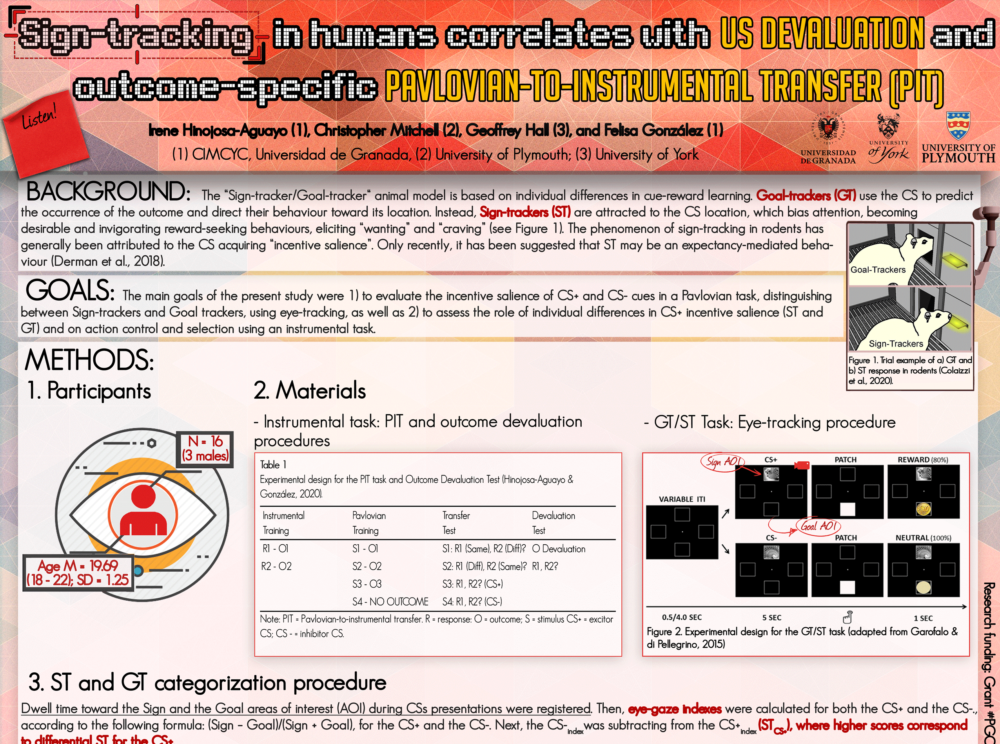
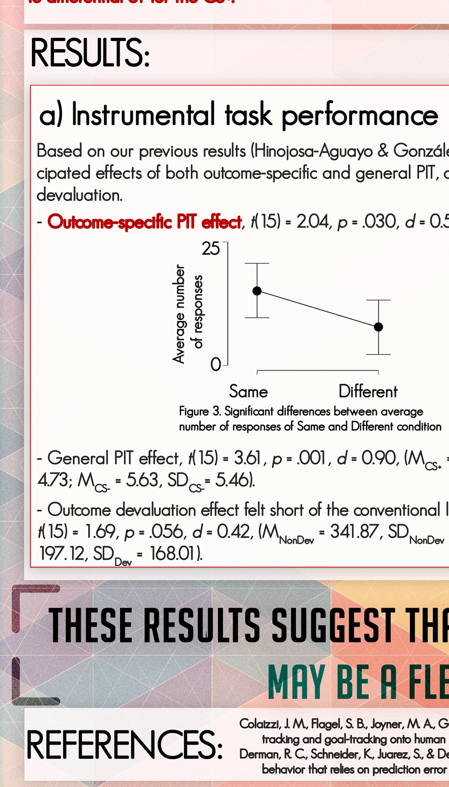
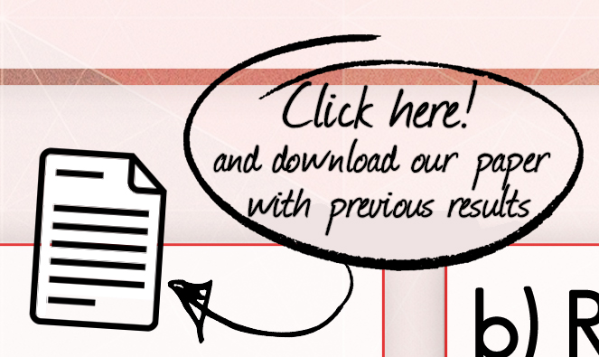
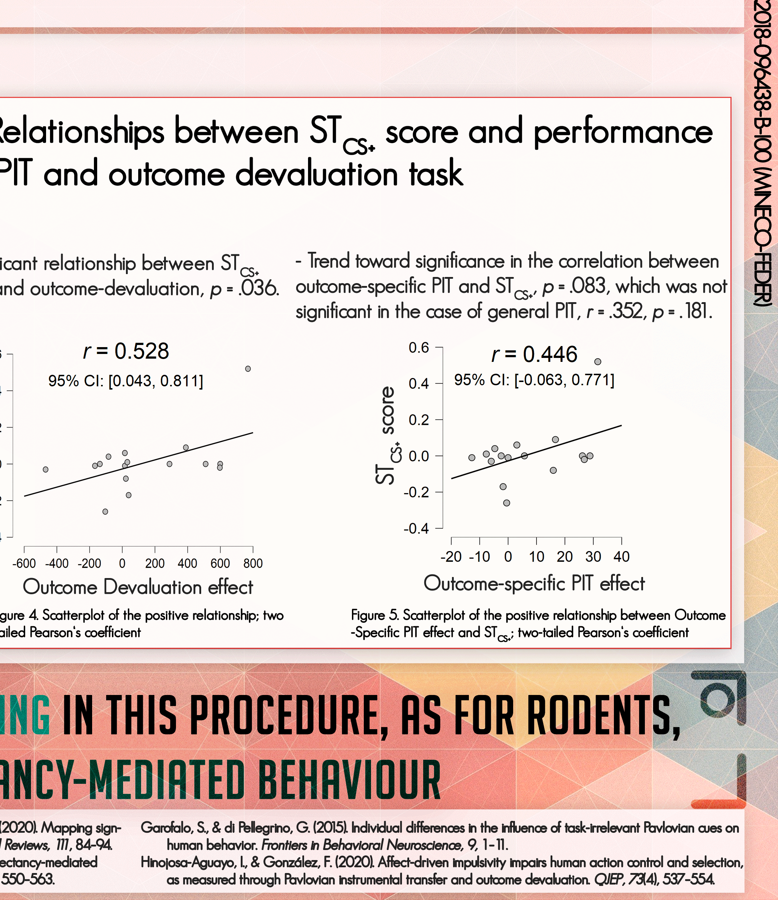
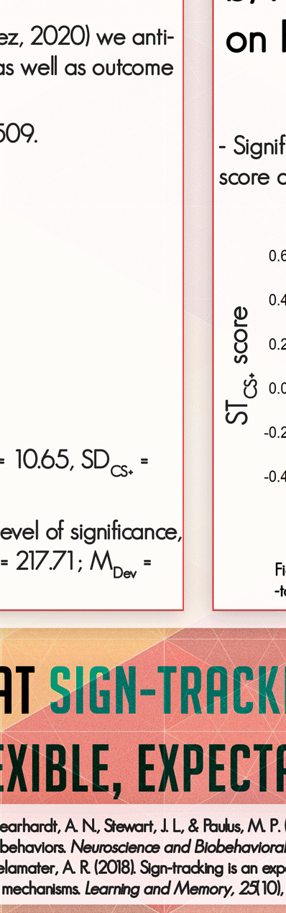

<html>
<head>
<title>Cartel Distractor Task_Fondo2</title>
<meta http-equiv="Content-Type" content="text/html; charset=utf-8">
</head>
<body bgcolor="#FFFFFF" leftmargin="0" topmargin="0" marginwidth="0" marginheight="0">
<!-- Save for Web Slices (Cartel Distractor Task_Fondo2.psd) -->
<table id="Tabla_01" width="4252" height="5669" border="0" cellpadding="0" cellspacing="0">
	<tr>
		<td colspan="3">
			</td>
	</tr>
	<tr>
		<td rowspan="2">
			</td>
		<td>
			</td>
		<td rowspan="2">
			</td>
	</tr>
	<tr>
		<td>
			</td>
	</tr>
</table>
<!-- End Save for Web Slices -->
</body>
</html>
